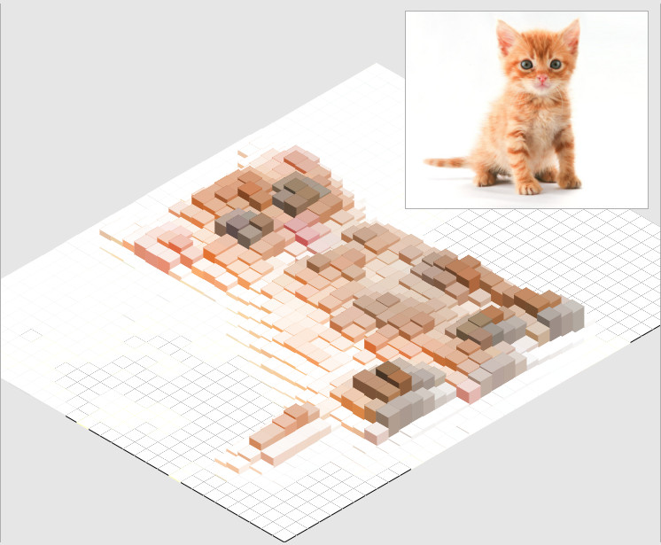

# IsomerHeightMap #

Create isometric heightmaps from images using @jdan's excellent [Isomer library](http://jdan.github.io/isomer/). 
 
## Example ##

**[Check out the demo](http://robosparrow.github.io/IsomerHeightMap)**
 


## How to use ##

1. Head over to the [Isomer reposirory](https://github.com/jdan/isomer) and grab the isomer.min.js
2. Include isomer.min.js & isomer-heightmap.js in your html

```
<script src="./vendor/isomer.js"></script>
<script src="./isomer-heigthmap.js"></script>
```

3. create a **canvas** element
4. Create IsomerHeightMap instance, load image and display.

Here is a simple example. [See live.](http://robosparrow.github.io/IsomerHeightMap/examples/basic.html)

```
<!DOCTYPE html>
<html>
	<head>
		<meta charset="UTF-8">
		<title>My Kitten Heightmap</title>
		<!-- load libraries -->
		<script src="../vendor/isomer.js"></script>
		<script src="../isomer-heigthmap.js"></script>
		<!-- my Heightmap -->
		<script>
			var IHM;
			document.addEventListener("DOMContentLoaded", function(event) {

				// Init: image
				var img = new Image();
				img.src = './example.jpg';
				
				// Init: render
				img.onload = function() {
					// Init: IHM instance
                    // (!) define canvas and the relative path from your html document to the isomer library
					IHM = new IsomerHeightMap('#IsomerHeightMap', '../');
					// load image
					IHM.image(this);
					//render and display
					IHM.render();
				};
			
			});
		</script>
	</head>
	
	<body>
		<!-- IsomerHeightMap canvas -->
        <canvas id="IsomerHeightMap"></canvas>
	</body>
</html> 
```

## API ##

Simple. There are three main functions and their options to keep in mind:

* this.image
* this.render
* this.heightMap

Listed in order of execution. Note that `render` shortcuts to `heightmap`.

### Constructor ###

```
var IHM = new IsomerHeightMap(<canvas selector>, <path to isomer-heightmap folder>);
```

Constructor. Creates a new IsomerHeightMap instance and links it to a `<canvas>` element.

**[!]** The webworker requires a valid path to the library, seen from the html document *(e.g. './js/vendor/isomer-heightmap/')*

### this.image ###

```
IHM.image(<Image object>, <options>);
```

Reads image into an off canvas and stores ImageData.

`<options>` (object):

 * `scaleTo` (object: width, height): down-scales larger images  to a certain width or height (performance!)

See also `defaults.image`.

### this.render ###

```
IHM.render(<grid options>, <isomer options>, <shape filters>);
```

Rasterises the ImageData and stores a grid with average color values.

`<grid options>` (object):

 * `scale` (number): The w/h size of a raster element (tile). The lower the size the more detailed the heightmap will be. (Performance penalty!).

See also `defaults.grid`.

`<isomer options>`, `<shape filters>`: See below, they are just passed on to IHM.heightMap()

### this.heightMap ###

```
IHM.heightMap(<isomer options>, <shape filters>);
```

Renders and displays the IsomerHeightmap into the canvas. This is where the Isomer library comes into play.

You can **chain** the transformations by repeatedly calling heightmap(), see the example on the project page. Reset them to defaults via `IHM.reset()`

`<isomer options>` (object):

 * scale: scales the heightmap
 
See also `defaults.isomer`.
 
`<shape filters>` (object):

 * `shape` (string): the Isomer shape to be rendered per tile ('Prism', 'Pyramid', 'Cylinder')
 * `greyscale` (bool)
 * `invert` (bool): when *false* then the height of the shapes will be proportional to the darkness of the color, opposite when *true*
 * `size` (number): unit size of a shape
 * `yScale` (number): scale height of tiles
 * `gap` (number): size of the gaps between the tiles

See also `defaults.shape`.

### this.import, this.export ###

A crude json import/export in case you want to save your heightmap. It doesn't saves the image data, so you can only apply `this.heightmap()` after importing.

### Events ###

`IHM-Render-Finished`: fired when *this.heightmap()* has finished with drawing to the canvas.
